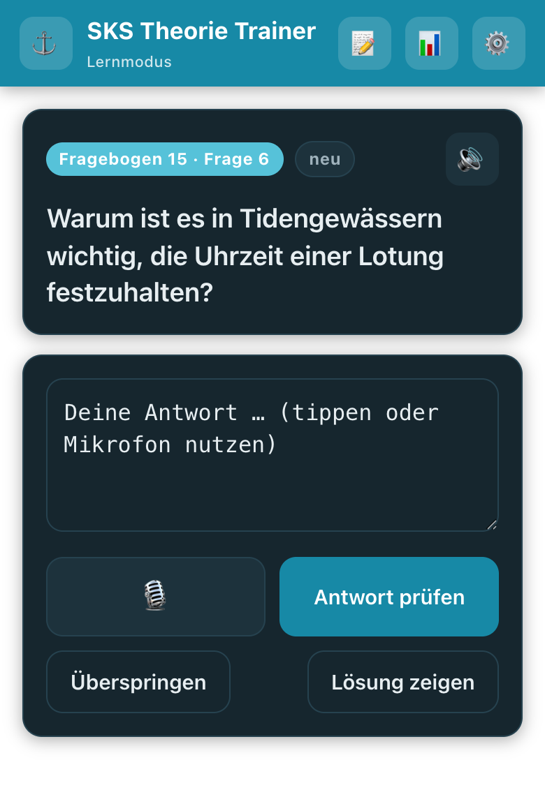
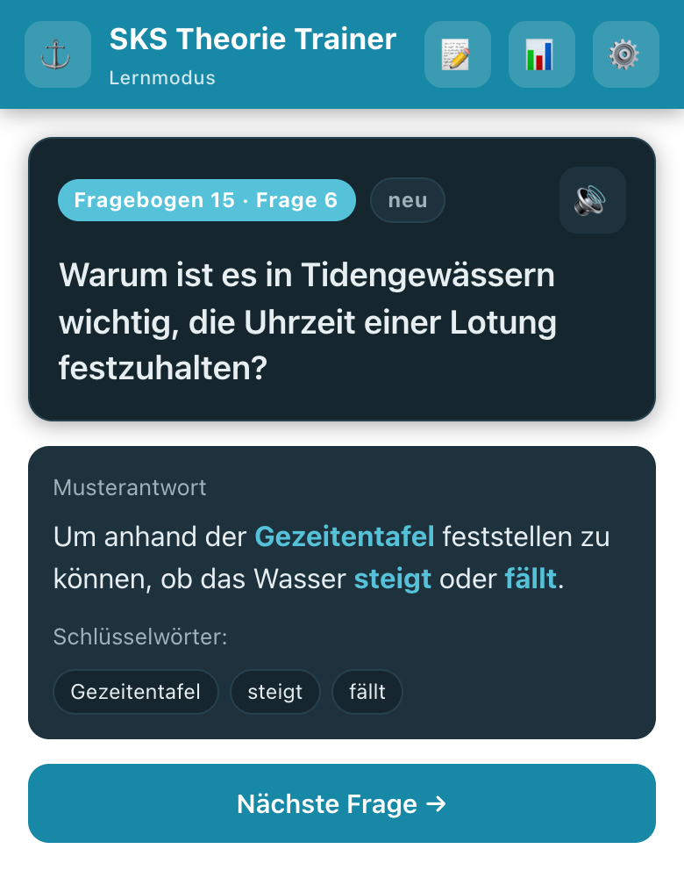
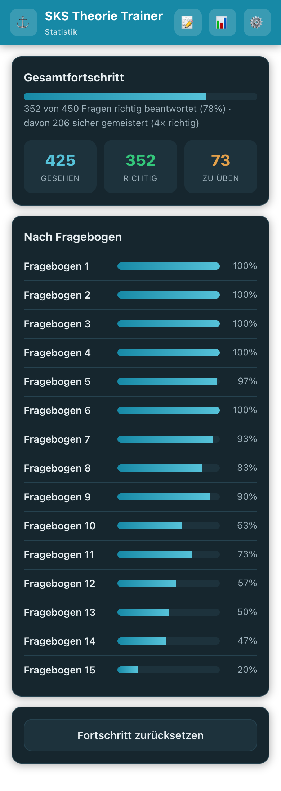

# ⚓ SKS Theorie Trainer

Lerne die **Theorieprüfung zum Sportküstenschifferschein (SKS)** direkt auf dem Handy –
mit allen 450 Fragen der 15 offiziellen Fragebögen, freier Antwort per **Tippen oder Sprechen**
und einer **KI, die deine Antwort wohlwollend bewertet** und dir sofort die Musterantwort zeigt.

Fragen, die du falsch oder nur teilweise beantwortest, kommen **gezielt häufiger dran**, bis sie
sitzen. So lernst du die Prüfung effizient, statt stur auswendig.

**👉 Direkt loslegen: [martinverges.github.io/sks-exam](https://martinverges.github.io/sks-exam/)**

---

## So sieht es aus

| Frage beantworten | Musterantwort & Schlüsselwörter | Fortschritt im Blick |
|---|---|---|
|  |  |  |

---

## Was der Trainer kann

- **Alle 450 offiziellen Fragen** (15 Fragebögen à 30 Fragen) – inklusive der **Skizzen und
  Diagramme** (Lichterführung, Betonnung, Wetterfronten …).
- **Frei antworten statt Multiple Choice** – tippe deine Antwort ein oder **sprich sie einfach ein**
  (Mikrofon-Knopf); die KI wandelt Gesprochenes in Text um.
- **Wohlwollende KI-Bewertung** – es kommt auf den Sinn an, nicht auf den exakten Wortlaut.
  Die wichtigsten **Schlüsselwörter** werden farbig hervorgehoben, damit du siehst, worauf es ankommt.
- **Musterantwort auf Knopfdruck** – nach jeder Antwort (oder direkt über „Lösung zeigen").
- **Vorlesen per KI-Stimme** – Fragen und Lösungen lassen sich vorlesen; einmal gehörte Antworten
  werden **zwischengespeichert** und beim nächsten Mal ohne Verzögerung abgespielt.
- **Cleveres Wiederholen** – Fehler werden priorisiert, sicher gemeisterte Fragen seltener gezeigt.
- **Prüfungsmodus** – ein kompletter Fragebogen unter realen Bedingungen mit 90-Minuten-Countdown.
- **Statistik** – Gesamtfortschritt und ein Balken je Fragebogen zeigen, wo du schon sicher bist.
- **Als App installierbar (PWA)** und **offline nutzbar** – Fragen, Bilder und Oberfläche laufen
  auch ohne Internet. Nur die **KI-Bewertung und die Sprachfunktionen brauchen eine
  Internetverbindung**.
- **Alles bleibt bei dir** – dein Lernfortschritt und dein Schlüssel werden **nur lokal auf deinem
  Gerät** gespeichert, es gibt keinen Server und kein Konto.

---

## Auf dem Handy installieren

Die App läuft direkt im Browser – du kannst sie aber wie eine echte App auf den Startbildschirm legen:

**iPhone / iPad (Safari)**
1. [martinverges.github.io/sks-exam](https://martinverges.github.io/sks-exam/) in **Safari** öffnen.
2. Auf **Teilen** (Quadrat mit Pfeil nach oben) tippen.
3. **„Zum Home-Bildschirm"** wählen → **Hinzufügen**.

**Android (Chrome)**
1. [martinverges.github.io/sks-exam](https://martinverges.github.io/sks-exam/) in **Chrome** öffnen.
2. Menü (drei Punkte) öffnen.
3. **„App installieren"** bzw. **„Zum Startbildschirm hinzufügen"** wählen.

Danach hast du ein App-Icon und kannst wie mit einer normalen App lernen – auch offline.

---

## Einmalig einrichten: KI aktivieren

Damit deine Antworten bewertet und Sprache/Vorlesen funktionieren, braucht die App Zugang zu einer KI.
Standardmäßig ist **OpenAI** voreingestellt – du musst nur einmal deinen persönlichen Schlüssel eintragen.

### Schritt 1 – OpenAI-Schlüssel besorgen
1. Konto anlegen unter **[platform.openai.com](https://platform.openai.com/)**.
2. Etwas **Guthaben aufladen** (unter *Settings → Billing*). Für das Lernen reichen wenige Euro locker –
   eine Antwortbewertung kostet nur den Bruchteil eines Cents.
3. Unter **[platform.openai.com/api-keys](https://platform.openai.com/api-keys)** einen neuen Schlüssel
   erstellen und **kopieren** (er beginnt mit `sk-…`). Der Schlüssel wird nur einmal angezeigt.

### Schritt 2 – Schlüssel in der App eintragen
1. In der App oben rechts auf **⚙️ Einstellungen**.
2. Den Schlüssel ins Feld **API-Schlüssel** einfügen.
3. Mit **„Verbindung testen"** prüfen – fertig.

> 🔒 Dein Schlüssel wird **ausschließlich lokal in deinem Browser** gespeichert und direkt an OpenAI
> geschickt – er landet nie auf einem fremden Server und ist in der veröffentlichten App nicht enthalten.

Optional lässt sich in den Einstellungen die **Spracheingabe** und das **Vorlesen** ein- und ausschalten
sowie einstellen, ob Frage und Lösung automatisch vorgelesen werden.

---

## Die Lernmodi

Über **⚙️ Einstellungen → Auswahlstrategie** legst du fest, wie die nächste Frage ausgewählt wird:

| Modus | Was er macht | Wann sinnvoll |
|-------|--------------|---------------|
| **Smart** (Standard) | Mischt klug: Fehler und neue Fragen kommen bevorzugt, Gemeistertes seltener. | Für den normalen Lernalltag – einfach loslegen. |
| **Nur neue Fragen** | Zeigt nur Fragen, die du noch nie beantwortet hast. | Um systematisch neuen Stoff durchzuarbeiten. |
| **Nur Problemfragen** | Wiederholt nur Fragen, die du zuletzt falsch oder schwach beantwortet hast. | Kurz vor der Prüfung, um Lücken zu schließen. |
| **Der Reihe nach** | Geht die Fragebögen der Reihe nach durch. | Wenn du strukturiert Bogen für Bogen lernen willst. |

Zusätzlich kannst du unten in den Einstellungen einzelne **Fragebögen aus- oder einblenden** und so
z. B. gezielt nur bestimmte Themengebiete üben.

---

## Prüfungsmodus 📝

Willst du den Ernstfall proben, tippe oben auf **📝**:

- **Ein kompletter Fragebogen (30 Fragen)** mit **90-Minuten-Countdown** (die Uhr wird gelb, wenn
  ≤ 5 Minuten übrig sind, und rot in der letzten Minute).
- Du beantwortest alle Fragen der Reihe nach – **ohne Zwischenfeedback**, genau wie in der echten Prüfung.
- Am Ende bewertet die KI alle Antworten auf einmal und zeigt dir:
  - **Gesamtergebnis in Prozent** und **bestanden / nicht bestanden** (Richtwert ≥ 75 %),
  - wie viele Antworten richtig, teilweise oder falsch waren und die benötigte Zeit,
  - eine **Detailauswertung je Frage** mit deiner Antwort, KI-Feedback und Musterantwort.

Wirst du unterbrochen, kannst du eine laufende Prüfung später **fortsetzen** – die Restzeit läuft weiter.

---

## Häufige Fragen

**Kostet die App etwas?**
Die App selbst ist kostenlos. Für die KI-Bewertung fallen nur die geringen Nutzungskosten deines
eigenen OpenAI-Guthabens an (Bruchteile von Cent pro Antwort).

**Funktioniert sie ohne Internet?**
Fragen, Bilder und die Oberfläche ja. Für die KI-Bewertung und die Sprachfunktionen ist eine
Internetverbindung nötig.

**Wo werden meine Daten gespeichert?**
Lernfortschritt, Einstellungen und dein Schlüssel bleiben lokal auf deinem Gerät. Es gibt kein Konto
und keinen zentralen Server.

**Warum eine „wohlwollende" Bewertung?**
Weil es in der mündlichen wie schriftlichen SKS-Prüfung auf das **sinngemäße Verständnis** ankommt.
Solange die Kernaussage und die wichtigen Stichworte stimmen, zählt die Antwort als richtig –
offensichtlich falsche Aussagen werden aber trotzdem als falsch erkannt.

---

*Viel Erfolg bei der Prüfung und immer eine Handbreit Wasser unter dem Kiel! ⛵*
